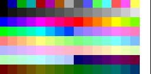
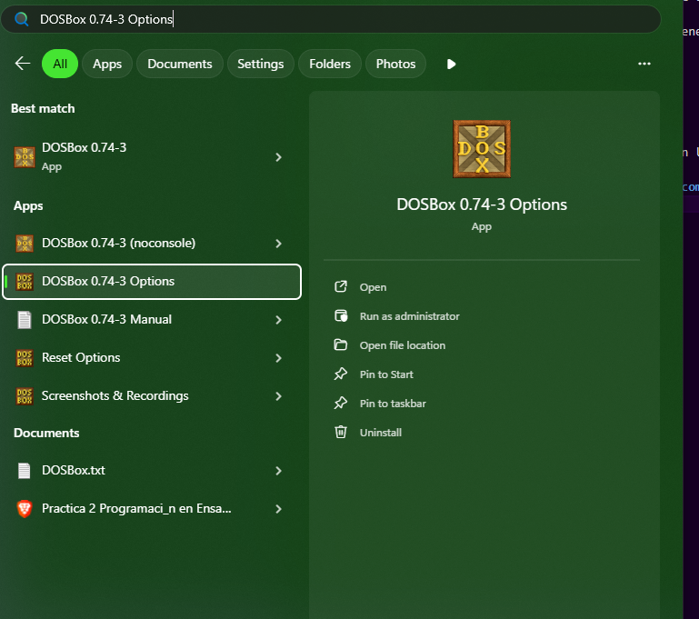
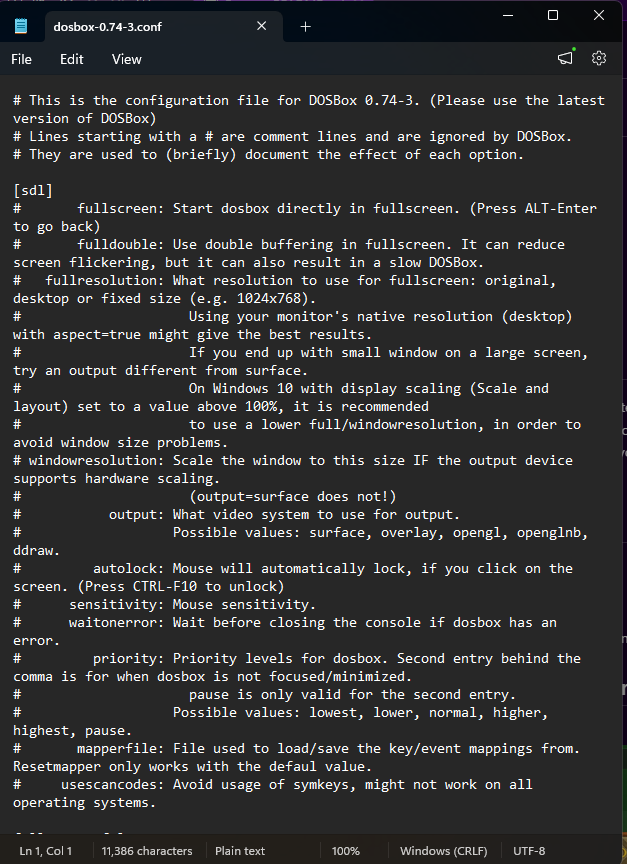
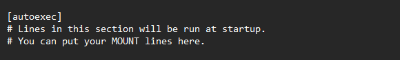
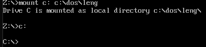

# Practica 3: Pixel art.

## Colores disponibles

Empieza la cuenta desde 0, ir aumentando 1.

## Para hacer funcionar las macros.
1. Crear el archivo de macros y guardarlo en cualquier extension.
2. Guardar el archivo de macros en la carpeta del emulador en el directorio inc.
3. Escribir `include nombre` al principio, si tiene el archivo extension también agregarla.

## Ejecutar el archivo
1. Abrir DOSBox
2. Escribir `mount c: c:\path\de\la\carpeta`
3. Escribir `c:`
4. Finalmente escribir el nombre del programa sin la extensión ".exe".

## Shortcut para evitar escribir los 2 primeros comandos
1. Buscar DOSBox

2. Elegir la opción que diga **Options**.
3. Te  abrirá un bloc de notas.

4. Bajar hasta la parte final del documento.

5. Escribir lo siguiente en líneas separadas: `mount c: c:\path\de\la\carpeta` y `c:`
6. Guardar y ejecutar el programa.
